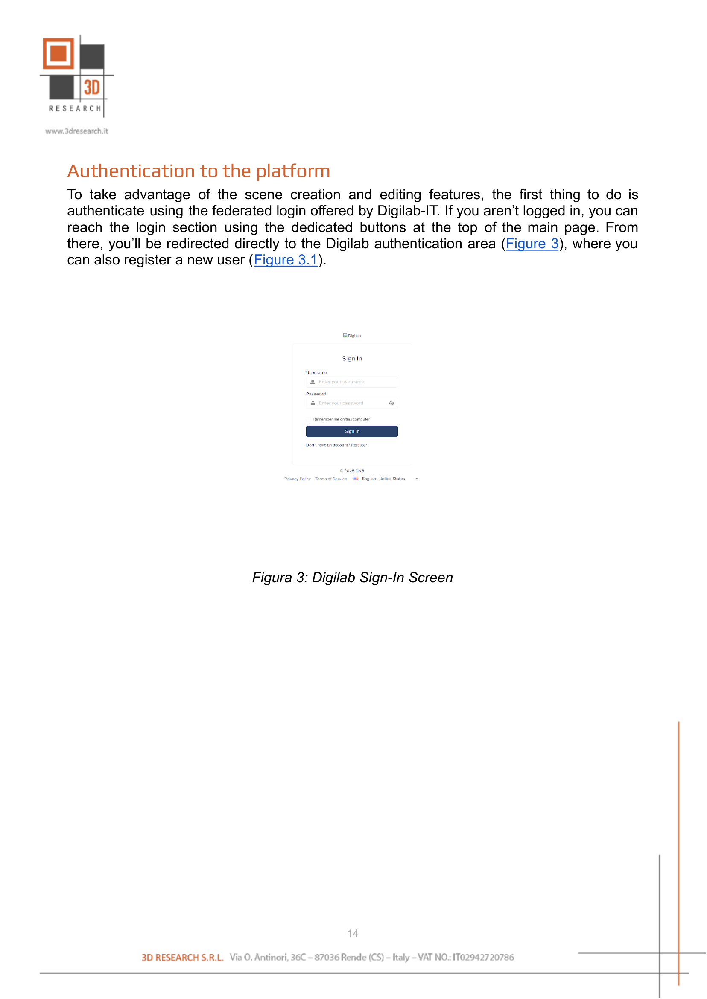
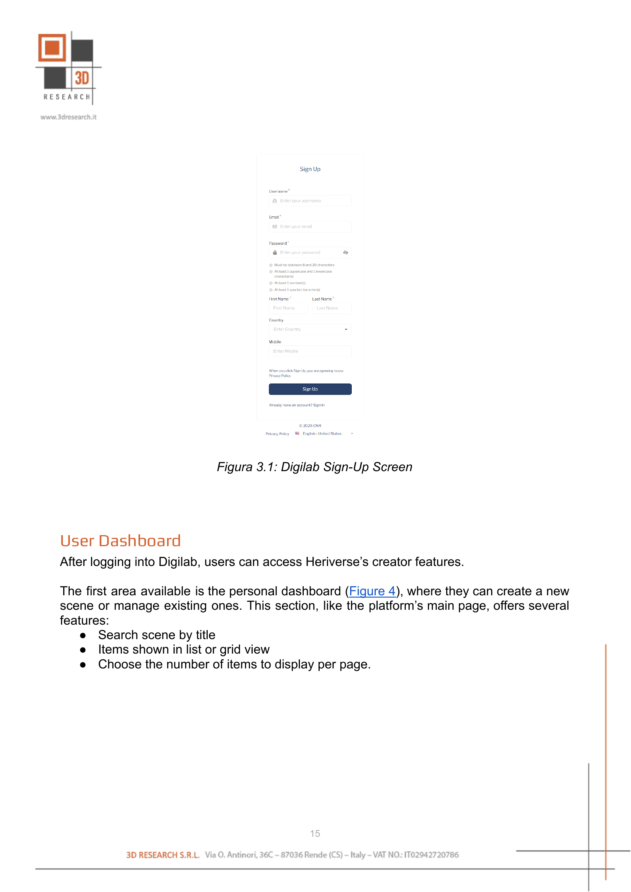

Authentication
==============

Authentication to the platform
------------------------------

To take advantage of the scene creation and editing features, the first thing to do is authenticate using the federated login offered by Digilab-IT. If you aren't logged in, you can reach the login section using the dedicated buttons at the top of the main page. From there, you'll be redirected directly to the Digilab authentication area (:numref:`fig3_digilab_signin`), where you can also register a new user (:numref:`fig3_1_digilab_signup`).

.. _fig3_digilab_signin:

   Digilab Sign-In Screen

.. _fig3_1_digilab_signup:

   Digilab Sign-Up Screen
