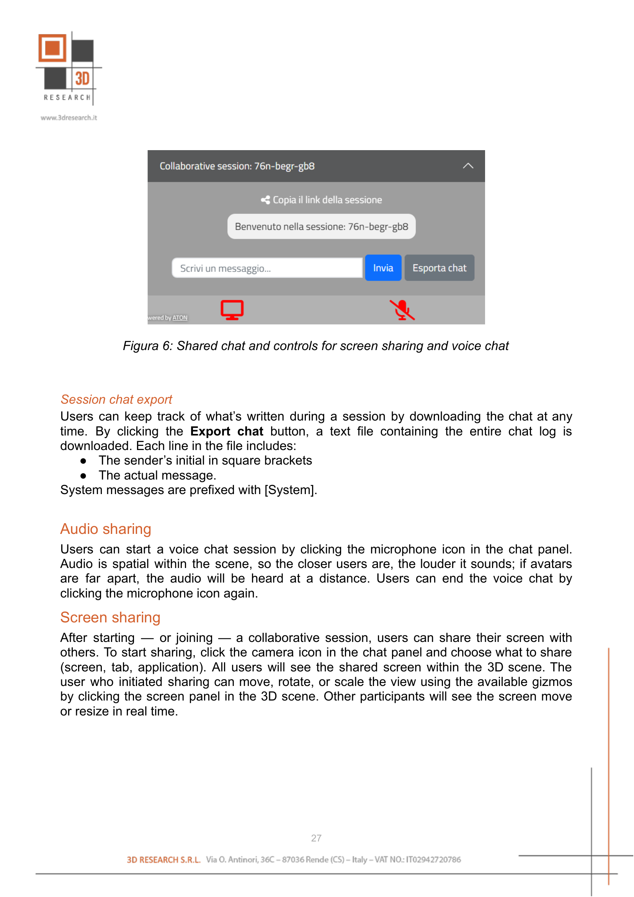
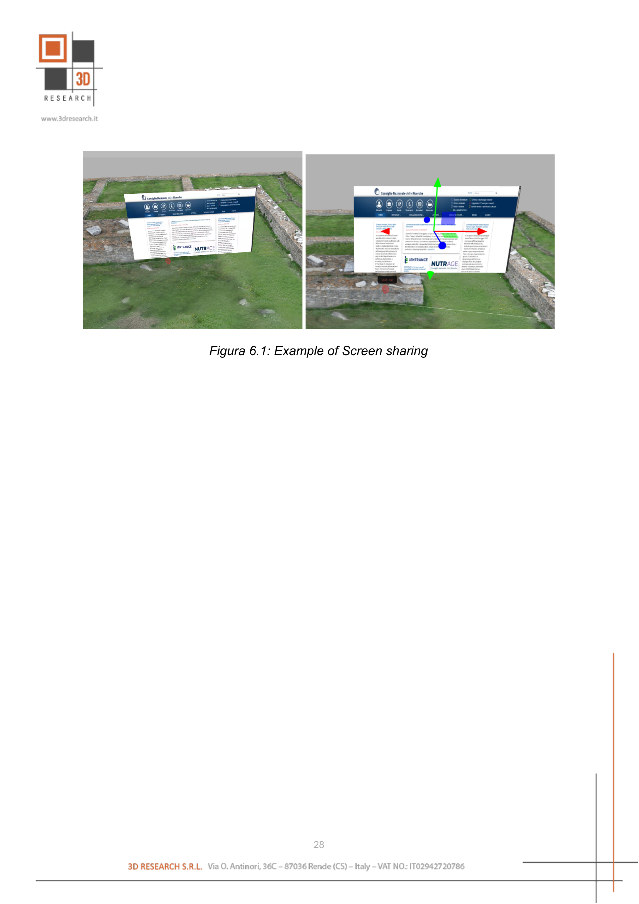

Collaborative Mode
==================

Heriverse allows you to collaborate with other users within the same scene, in both viewing and editing modes.

During a collaborative session:

- Each user is represented by an avatar visible in the scene
- A text chat is available and can be exported at any time
- Voice communication can be enabled between participants
- Screen sharing is available: the shared content is projected onto a virtual plane visible in the scene. This plane can be moved, rotated, and resized as needed.

This feature is useful for co-design activities, group reviews, or guided presentations in immersive environments.

Starting a collaborative session
---------------------------------

An authenticated user can start a collaborative session with others by clicking the **Start new session** button at the bottom-left of the screen. After starting the session, the chat box opens; you can copy the link using the dedicated button and invite other users simply by sending them the link. Users who receive the link can paste it into their browser to join the collaborative session.

Session chat
------------

Users in the same session can send chat messages via the chat panel at the bottom-left of the screen. In addition to user messages, the chat box also displays system messages (for example: "User Mario Rossi has joined the session"). System messages are centered; messages received by the user are left-aligned; messages sent by the user are right-aligned. For messages sent by users, the sender's initials (first and last name) appear next to each message.

.. _fig6_collaborative_chat:

   Shared chat and controls for screen sharing and voice chat

Session chat export
^^^^^^^^^^^^^^^^^^^

Users can keep track of what's written during a session by downloading the chat at any time. By clicking the **Export chat** button, a text file containing the entire chat log is downloaded. Each line in the file includes:

- The sender's initial in square brackets
- The actual message

System messages are prefixed with ``[System]``.

Audio sharing
-------------

Users can start a voice chat session by clicking the microphone icon in the chat panel. Audio is spatial within the scene, so the closer users are, the louder it sounds; if avatars are far apart, the audio will be heard at a distance. Users can end the voice chat by clicking the microphone icon again.

Screen sharing
--------------

After starting -- or joining -- a collaborative session, users can share their screen with others. To start sharing, click the camera icon in the chat panel and choose what to share (screen, tab, application). All users will see the shared screen within the 3D scene. The user who initiated sharing can move, rotate, or scale the view using the available gizmos by clicking the screen panel in the 3D scene. Other participants will see the screen move or resize in real time.

.. _fig6_1_screen_sharing:

   Example of Screen sharing
