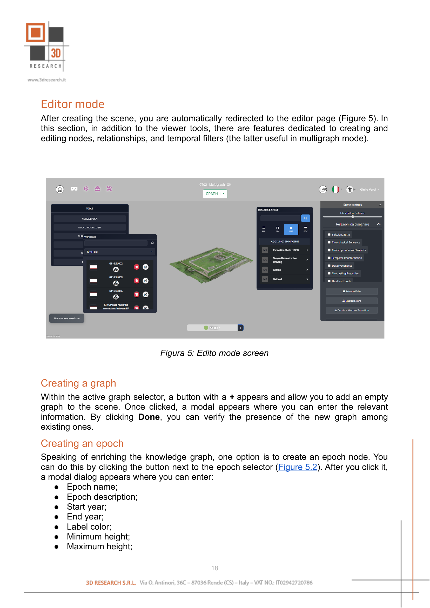

Editor Mode
===========

After creating the scene, you are automatically redirected to the editor page (:numref:`fig5_editor_mode`). In this section, in addition to the viewer tools, there are features dedicated to creating and editing nodes, relationships, and temporal filters (the latter useful in multigraph mode).

.. _fig5_editor_mode:

   Editor mode screen

Creating a graph
----------------

Within the active graph selector, a button with a **+** appears and allows you to add an empty graph to the scene. Once clicked, a modal appears where you can enter the relevant information. By clicking **Done**, you can verify the presence of the new graph among existing ones.

Creating an epoch
-----------------

Speaking of enriching the knowledge graph, one option is to create an epoch node. You can do this by clicking the button next to the epoch selector. After you click it, a modal dialog appears where you can enter:

- Epoch name
- Epoch description
- Start year
- End year
- Label color
- Minimum height
- Maximum height

Since this button is available only when a single graph is active, you can also create an epoch node using the button in the Tools panel.

Temporal filters management
----------------------------

As described in the viewer section, when multiple graphs are active, the system switches from filtering by the epochs of the active graph to filtering items based on a predefined time filter. In addition to the controls described on the previous pages about the viewer, there are two additional buttons (:numref:`fig5_1_temporal_filters_editor`) that let you:

- **Modify** a temporal filter, which opens a modal dialog containing all the filter's details for editing.
- **Save** the filter; when values are entered in the text fields, a modal dialog appears where you can enter:

  - Filter name
  - Filter description
  - Label color

.. _fig5_1_temporal_filters_editor:

   Temporal filters section in the editor and Epoch selector with button for creating new epochs
