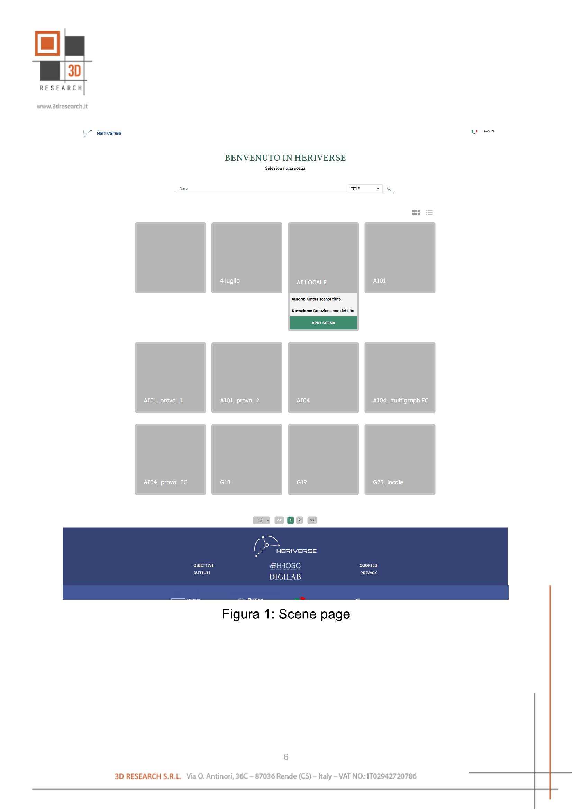

Scene Gallery
=============

Access to the scene gallery
---------------------------

When the platform loads, the user interface presents a home screen containing a set of cards representing all the scenes marked as public by their creators. Each card serves as an access point to an interactive viewer, allowing exploration of the scene and the use of shared tools accessible to all users.

To access a scene viewer, simply select the relevant card: this activates the display of a detail sheet, from which you can launch the interactive component via a dedicated **OPEN SCENE** button.

.. _fig1_scene_page:

   Scene page

Searching for a scene
---------------------

In addition to the overview of public scenes, you can search for a scene by title. To do this, simply enter text in the bar below the title and click **ENTER**. The system will automatically display the scenes whose title contains the search string.

View options
------------

By default, a grid layout is provided for displaying scene elements, with each element represented as a card. Using the buttons located immediately above the card section, you can also toggle between a list view of the elements. Furthermore, using the selector next to the pagination buttons, you can choose how many elements to display on a single page.
