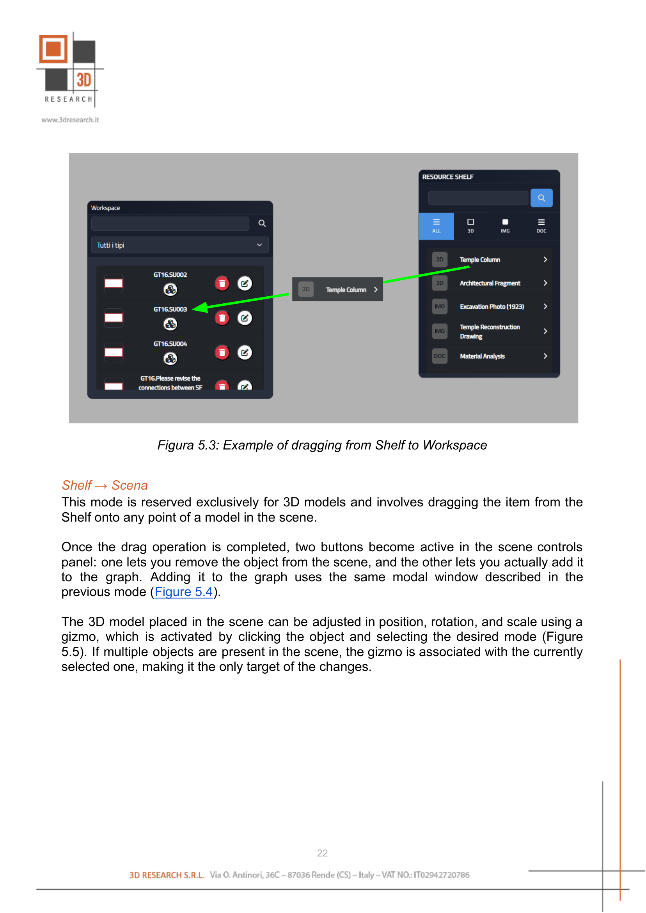
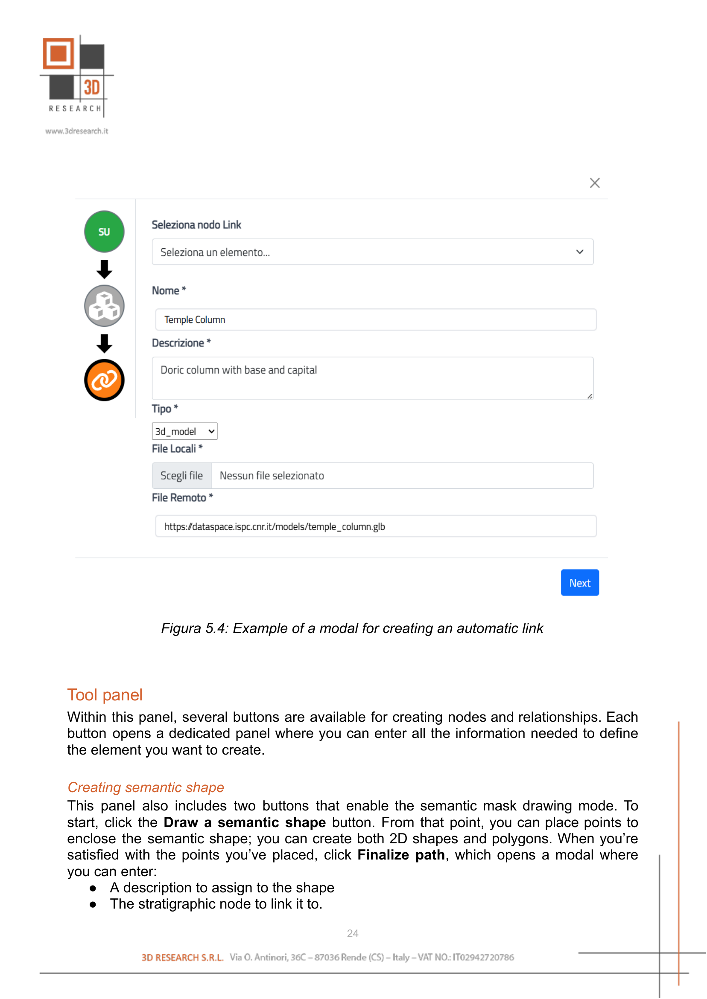

Semantic Enrichment and Node Management
=======================================

In editor mode, a set of panels is available to streamline operations. The key elements in this mode are:

- Workspace panel
- Shelf panel
- Tools panel

Workspace panel
---------------

This component lists all the nodes in the active graphs, providing an overview of existing items and the ability to edit or remove them.

Node search
^^^^^^^^^^^

Given the potentially large number of nodes in the active graphs, a convenient tool is the search bar. To better orient yourself or find a specific node, simply start typing in the bar to filter the panel's content by name. Note that the search affects only the selected panel.

Managing nodes
^^^^^^^^^^^^^^

To let users modify or delete nodes already present in the graph, each item in the Workspace has two buttons for deleting and editing the node, respectively.

Clicking the **delete button** (red background with a trash icon) and confirming in the browser alert deletes the selected node and any relationship connected to it.

Clicking the **edit button** (white background with a pencil-over-square icon) opens a modal dialog with the selected node's information, from which you can make changes and then save them.

Some items also have a third button. These items are stratigraphic units associated with semantic shapes. This button serves two purposes:

- Identify nodes that have an associated semantic shape
- On click, make the semantic shape visible if it is present in the scene

Shelf panel
-----------

It is one of the key components for enriching the knowledge graph semantically, as it serves as the information source to associate with stratigraphic nodes. It contains 3D models, images, and documents that can be added to existing graphs in two ways: by dragging items into the Workspace panel or directly into the scene.

New content can be added to the Shelf via dedicated buttons in the sections for each resource type. You can also filter the contents here using a search bar.

Advanced search
^^^^^^^^^^^^^^^

Using the search bar, you can find the desired content within the active panel. If you start typing text, the system shows items whose names contain the entered text; if you enter a resource URL, the system will show, if present, the item whose URL matches what you entered. Since GLTF files come with an accompanying BIN file and a PNG texture, providing the GLTF file link is sufficient to find the item.

Adding items to the shelf
^^^^^^^^^^^^^^^^^^^^^^^^^

Using the buttons in the specific sub-panels, you can enrich the Shelf's contents. New items are created via a modal dialog where you can specify:

- Item name
- Item description
- Remote link or local file(s) for the resource

As noted, you can add 3D models, images, and documents.

For uploading **3D models**, you can use GLTF, GLB, OBJ, B3M (Cesium tileset), and FBX files. If you want to upload a GLTF file:

- For local files, you must also upload the associated BIN file and the PNG texture
- For remote links, the associated BIN file and PNG texture must reside in the same repository

Supported **image** formats:

- JPG
- PNG
- TIFF

Supported **document** formats:

- PDF
- DOC
- TXT

Shelf to Workspace
^^^^^^^^^^^^^^^^^^

One way to add content is to drag an item from the Shelf onto a stratigraphic node in the Workspace (:numref:`fig5_3_shelf_workspace_drag`). Unlike dragging into the scene -- which is limited to 3D models -- this method can be used with any type of content available on the Shelf.

After dragging, a panel opens, allowing you to choose the type of node to associate with the resource. Once you make this choice, the system automatically computes the sequence of nodes and relationships needed to link the two elements and opens a modal window (:numref:`fig5_4_automatic_link_modal`) to finalize creation of the path.

.. _fig5_3_shelf_workspace_drag:

   Example of dragging from Shelf to Workspace

Shelf to Scene
^^^^^^^^^^^^^^

This mode is reserved exclusively for 3D models and involves dragging the item from the Shelf onto any point of a model in the scene.

Once the drag operation is completed, two buttons become active in the scene controls panel: one lets you remove the object from the scene, and the other lets you actually add it to the graph. Adding it to the graph uses the same modal window described in the previous mode.

The 3D model placed in the scene can be adjusted in position, rotation, and scale using a gizmo, which is activated by clicking the object and selecting the desired mode. If multiple objects are present in the scene, the gizmo is associated with the currently selected one, making it the only target of the changes.

Automatic path creation
-----------------------

For the semantic enrichment performed using Shelf items, a specific procedure is used. After dragging into the Workspace or clicking the **Add to graph** button (found in the scene controls), a modal appears that lets you choose what type of element should be associated with the Shelf link. The options are:

- **Representation Model**
- **Document**
- **Special Find**

A special case arises when adding images or documents, since they can be inserted into a graph only by linking them to a Document node; for this reason, in these two cases, only the Document option is available. For 3D models, instead, you can choose any of the three types:

- **Representation Model**, if you want to add it to a stratigraphic unit in general
- **Document**, if you want to avoid binding the model to epochs
- **Special Find**, if you want to link it to a special find

After making this choice, the system uses an algorithm to automatically compute the shortest path that will connect the Shelf item and the stratigraphic node in the graph.

At the end of this procedure, the modal shown in :numref:`fig5_4_automatic_link_modal` appears. There will be as many steps as the number of nodes involved in the path; for steps associated with known elements, the fields are auto-filled.

To guide the user through the steps, there is a sidebar structured like a graph, where each circle represents a step to complete. To provide feedback on completion status, each circle can appear in three colors:

- **Gray**, if no node has been selected and no information has been entered in the forms
- **Orange**, if the information has been entered only partially
- **Green**, if the information provided is sufficient

.. _fig5_4_automatic_link_modal:

   Example of a modal for creating an automatic link
