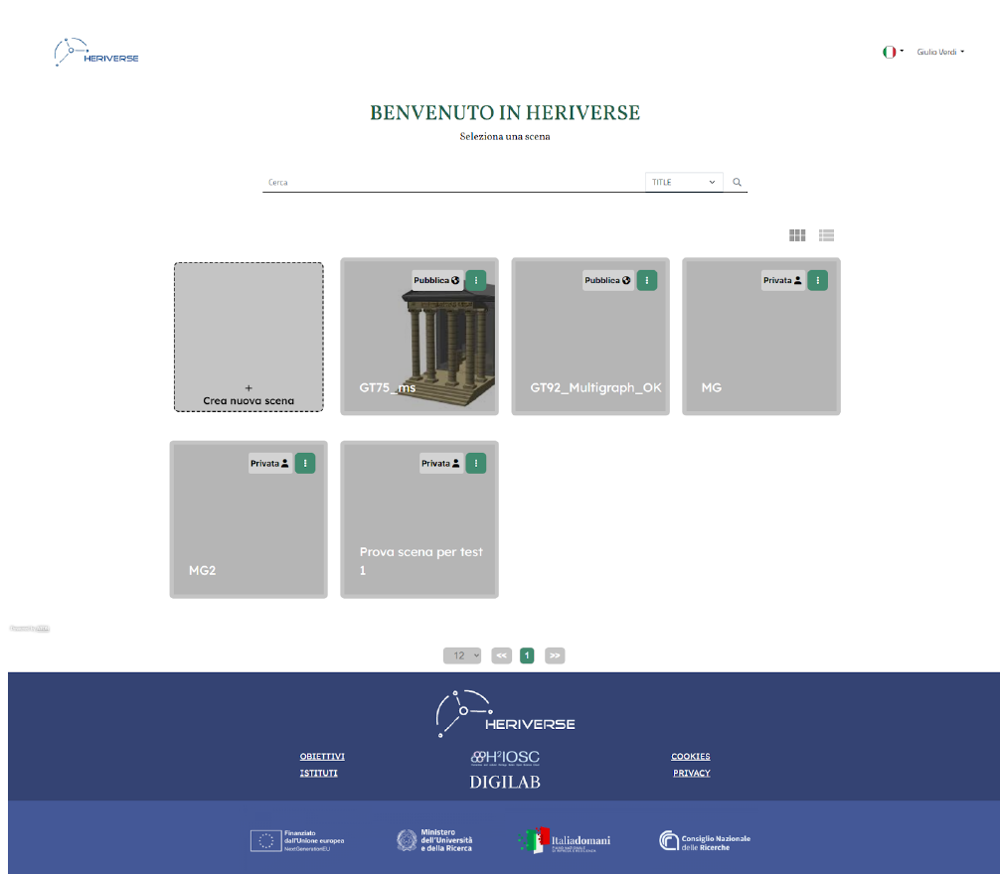
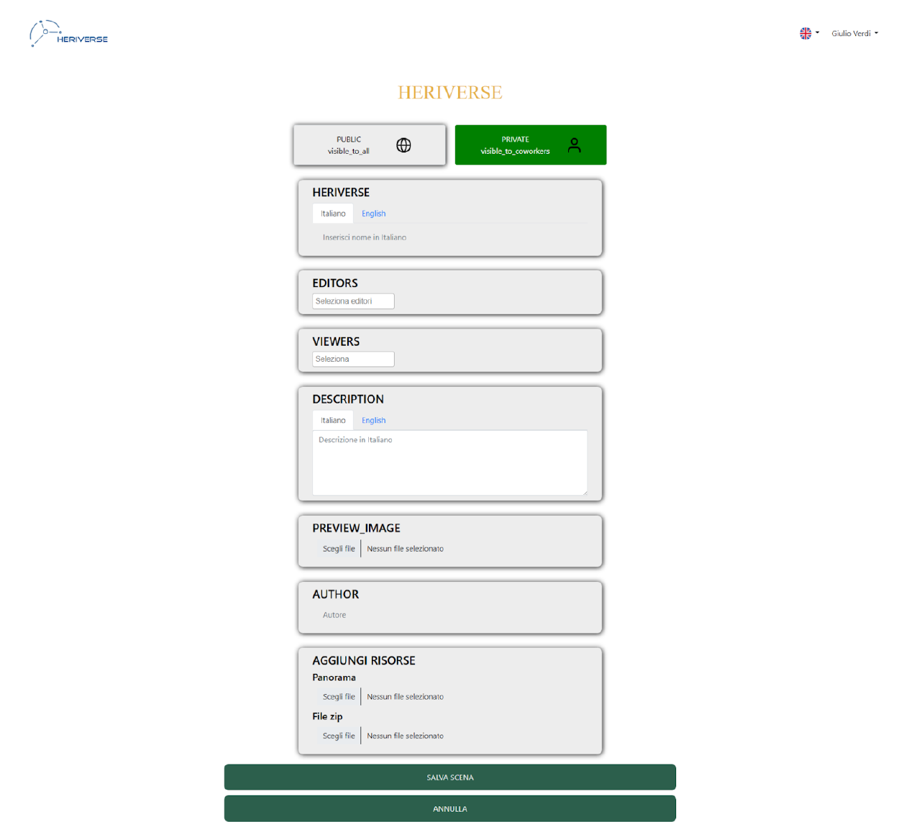

.. _publish-via-heriverse:

User Dashboard
==============

.. note::

   **Publishing a reconstruction via Heriverse**

   Heriverse is the web viewer where Extended Matrix reconstructions
   live online. The publication flow has two halves:

   1. **Export side (EM Tools)** — from Blender, export the scene
      together with its EM graph in the Heriverse format. The output
      is a self-contained bundle (3D geometry + graph + paradata
      assets) ready for upload. See the *Export Manager → Heriverse
      Export* section of the EM Tools manual:
      `Export Manager
      <https://docs.extendedmatrix.org/projects/EM-tools/en/latest/panels/export_manager.html>`_.
   2. **Heriverse side** (this page) — from the User Dashboard,
      create a new scene and upload the bundle. Heriverse parses the
      bundle, renders the 3D scene in the browser, and exposes the
      paradata chain via click-to-inspect interactions.

   You can choose what to share: *documentation only* (graph +
   paradata, suitable for stratigraphy publication) or *full
   reconstruction* (epochs + 3D scene + paradata, suitable for
   polished public output). Both flow through the same Heriverse
   scene-creation tab — only the payload extent changes.

   The bundle is the source of truth: once published, the scene is
   shareable via a URL. Any changes to the underlying graph or
   geometry require re-exporting from EM Tools and re-uploading —
   there is no live edit-in-place from the web side.

After logging into Digilab, users can access Heriverse's creator features.

The first area available is the personal dashboard (:numref:`fig4_user_dashboard`), where they can create a new scene or manage existing ones. This section, like the platform's main page, offers several features:

- Search scene by title
- Items shown in list or grid view
- Choose the number of items to display per page

.. _fig4_user_dashboard:

   User dashboard

Creating a scene
----------------

To start using your own graph, you need to create a new scene (:numref:`fig4_1_scene_creation`) and import a ZIP file containing all the necessary elements.

When creating the scene, the first choice concerns visibility:

- set it to **Public**, if you want it to be accessible to all platform visitors;
- or to **Private**, to limit access to specific users.

Using the appropriate fields, you can also define who can view the scene and who is authorized to edit it.

In addition to the ZIP file containing the graph information, you can upload a panoramic image, which will be used as the background of the 3D environment.

.. _fig4_1_scene_creation:

   Scene creation page
