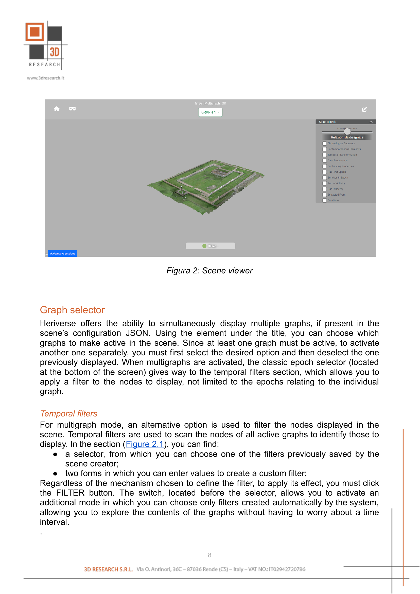
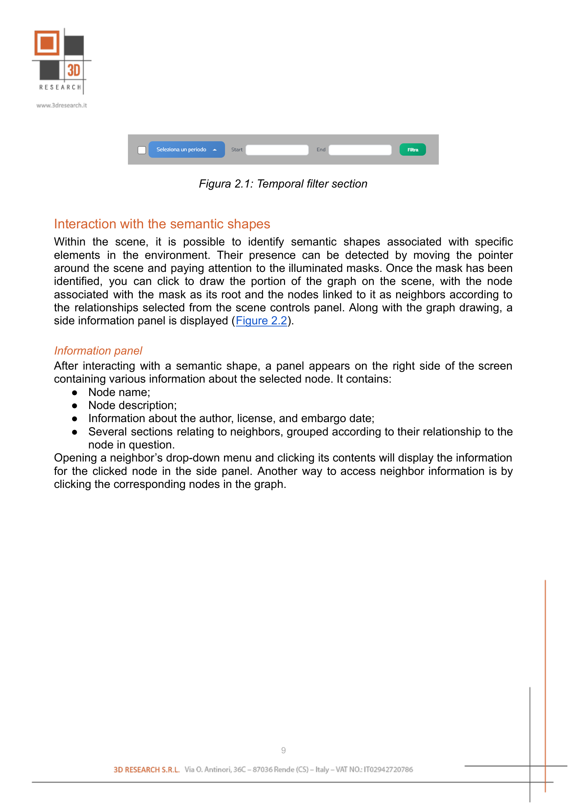
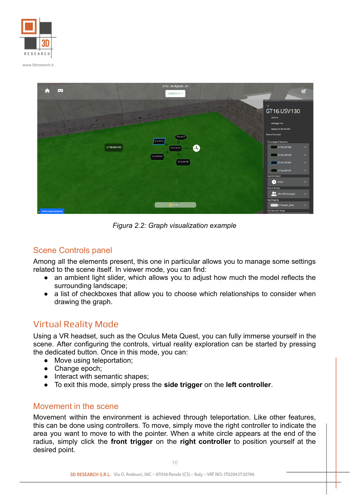

Viewing a Scene
===============

Once you click the button that opens a scene's detail sheet, you access the viewer (:numref:`fig2_scene_viewer`). The interface is divided into three main sections.

In the **top bar**, the scene title is visible in the center, followed immediately below by the active graph selector, which allows you to access multigraph mode. In this mode, you can filter the visible elements in the scene based on a selected time period. On the left side of the bar are two buttons: one allows you to return to the scene gallery, and the other starts VR mode (visible only if your device supports virtual reality). On the right side, there is another button that allows you to switch to editor mode, which is only active if the user has permissions to edit the scene; otherwise, you will be asked to log in.

The **bottom bar** contains tools for selecting and displaying elements in the scene, with behavior that varies depending on the active mode. When only one graph is present, a simple selector is displayed for switching between epochs. If multiple graphs are active, the bar is enriched with additional tools: a selector for choosing between the temporal filters already saved in the scene, two fields for manually entering the values of a custom filter, and a button to apply that filter (:numref:`fig2_1_temporal_filter`). A switch, positioned before these tools, allows you to switch from this mode to an alternative selector that offers a series of filters automatically generated by the system.

The **drop-down panel** contains scene management controls. Here, you'll find a slider that adjusts the effect of ambient light on the displayed elements and a list of options to choose which relationships to display when viewing graphs. This customization enhances the exploratory experience within the scene.

While exploring, you may encounter semantic masks associated with some elements. Clicking on one of them displays a portion of the graph originating from the selected node. The nodes displayed are their direct neighbors, with the exception of "property" nodes, for which the portion of the graph extends to the associated document. Along with the graph drawing, a sidebar displays information about the selected node, including a list of its neighbors (:numref:`fig2_2_graph_visualization`).

.. _fig2_scene_viewer:

   Scene viewer

Graph selector
--------------

Heriverse offers the ability to simultaneously display multiple graphs, if present in the scene's configuration JSON. Using the element under the title, you can choose which graphs to make active in the scene. Since at least one graph must be active, to activate another one separately, you must first select the desired option and then deselect the one previously displayed. When multigraphs are activated, the classic epoch selector (located at the bottom of the screen) gives way to the temporal filters section, which allows you to apply a filter to the nodes to display, not limited to the epochs relating to the individual graph.

Temporal filters
----------------

For multigraph mode, an alternative option is used to filter the nodes displayed in the scene. Temporal filters are used to scan the nodes of all active graphs to identify those to display. In the section (:numref:`fig2_1_temporal_filter`), you can find:

- a selector, from which you can choose one of the filters previously saved by the scene creator;
- two forms in which you can enter values to create a custom filter.

Regardless of the mechanism chosen to define the filter, to apply its effect, you must click the **FILTER** button. The switch, located before the selector, allows you to activate an additional mode in which you can choose only filters created automatically by the system, allowing you to explore the contents of the graphs without having to worry about a time interval.

.. _fig2_1_temporal_filter:

   Temporal filter section

Interaction with the semantic shapes
-------------------------------------

Within the scene, it is possible to identify semantic shapes associated with specific elements in the environment. Their presence can be detected by moving the pointer around the scene and paying attention to the illuminated masks. Once the mask has been identified, you can click to draw the portion of the graph on the scene, with the node associated with the mask as its root and the nodes linked to it as neighbors according to the relationships selected from the scene controls panel. Along with the graph drawing, a side information panel is displayed (:numref:`fig2_2_graph_visualization`).

Information panel
^^^^^^^^^^^^^^^^^

After interacting with a semantic shape, a panel appears on the right side of the screen containing various information about the selected node. It contains:

- Node name
- Node description
- Information about the author, license, and embargo date
- Several sections relating to neighbors, grouped according to their relationship to the node in question

Opening a neighbor's drop-down menu and clicking its contents will display the information for the clicked node in the side panel. Another way to access neighbor information is by clicking the corresponding nodes in the graph.

.. _fig2_2_graph_visualization:

   Graph visualization example

Scene Controls panel
--------------------

Among all the elements present, this one in particular allows you to manage some settings related to the scene itself. In viewer mode, you can find:

- an **ambient light slider**, which allows you to adjust how much the model reflects the surrounding landscape;
- a **list of checkboxes** that allow you to choose which relationships to consider when drawing the graph.
