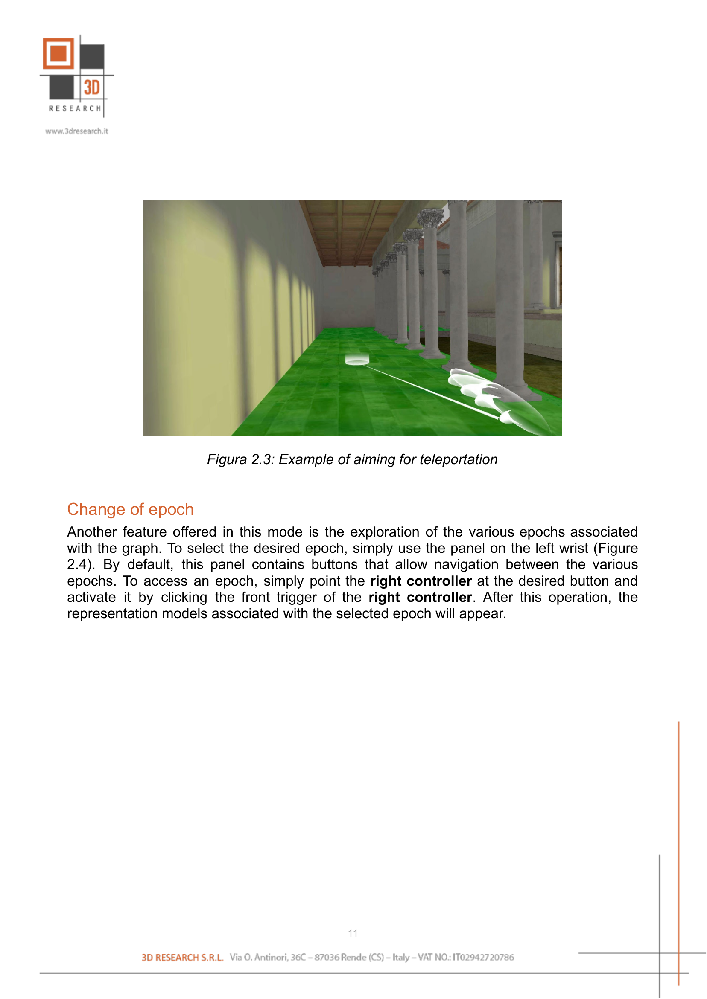
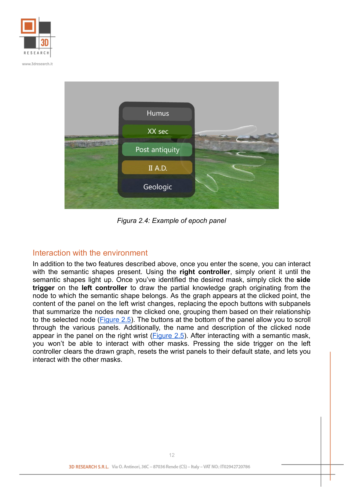
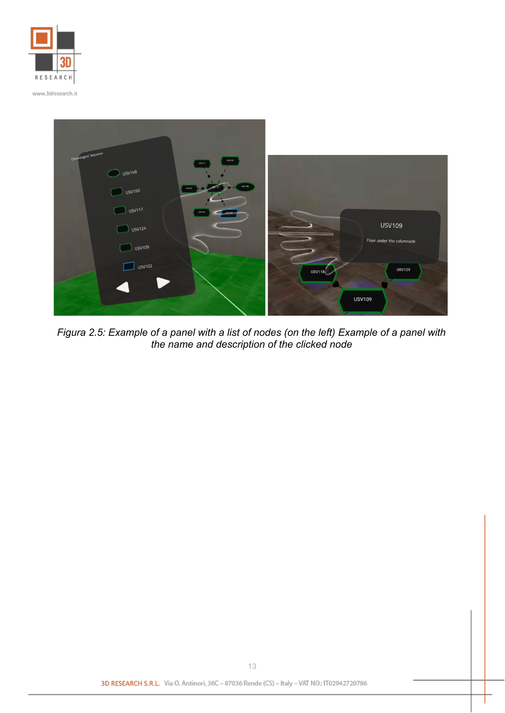

Virtual Reality Mode
====================

Using a VR headset, such as the Oculus Meta Quest, you can fully immerse yourself in the scene. After configuring the controls, virtual reality exploration can be started by pressing the dedicated button. Once in this mode, you can:

- Move using teleportation
- Change epoch
- Interact with semantic shapes
- To exit this mode, simply press the side trigger on the left controller

Movement in the scene
---------------------

Movement within the environment is achieved through teleportation. Like other features, this can be done using controllers. To move, simply move the right controller to indicate the area you want to move to with the pointer. When a white circle appears at the end of the radius, simply click the front trigger on the right controller to position yourself at the desired point.

.. _fig2_3_teleportation:

   Example of aiming for teleportation

Change of epoch
---------------

Another feature offered in this mode is the exploration of the various epochs associated with the graph. To select the desired epoch, simply use the panel on the left wrist (:numref:`fig2_4_epoch_panel`). By default, this panel contains buttons that allow navigation between the various epochs. To access an epoch, simply point the right controller at the desired button and activate it by clicking the front trigger of the right controller. After this operation, the representation models associated with the selected epoch will appear.

.. _fig2_4_epoch_panel:

   Example of epoch panel

Interaction with the environment
---------------------------------

In addition to the two features described above, once you enter the scene, you can interact with the semantic shapes present. Using the right controller, simply orient it until the semantic shapes light up. Once you've identified the desired mask, simply click the side trigger on the left controller to draw the partial knowledge graph originating from the node to which the semantic shape belongs.

As the graph appears at the clicked point, the content of the panel on the left wrist changes, replacing the epoch buttons with subpanels that summarize the nodes near the clicked one, grouping them based on their relationship to the selected node (:numref:`fig2_5_node_panels`). The buttons at the bottom of the panel allow you to scroll through the various panels. Additionally, the name and description of the clicked node appear in the panel on the right wrist.

After interacting with a semantic mask, you won't be able to interact with other masks. Pressing the side trigger on the left controller clears the drawn graph, resets the wrist panels to their default state, and lets you interact with the other masks.

.. _fig2_5_node_panels:

   Example of a panel with a list of nodes (on the left) and a panel with the name and description of the clicked node (on the right)
